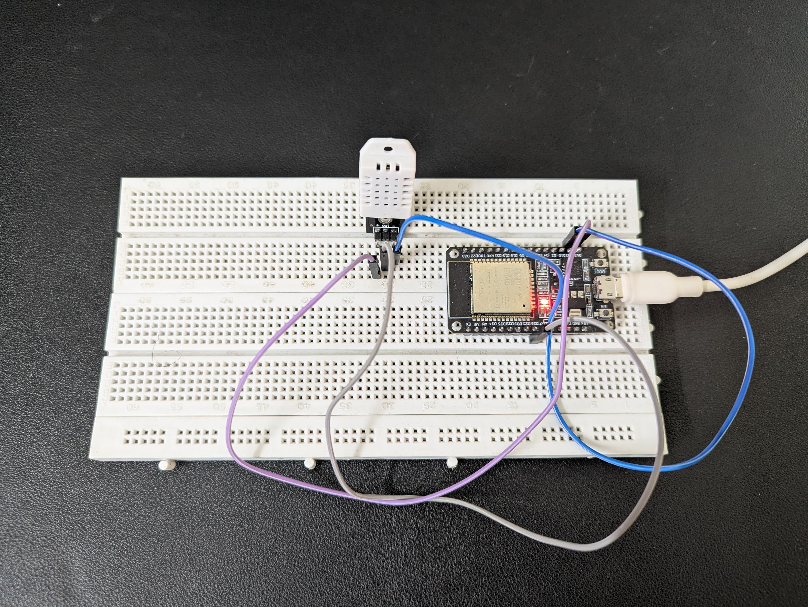

# IoT + Blockchain Sensor System

### Decentralized Environmental Monitoring using ESP32, Flask & Ethereum (Sepolia)


This project demonstrates a **tamper-proof IoT data logging system** using:

- ESP32 + DHT22 temperature & humidity sensor
- Flask backend server
- SHA-256 hashing for data integrity
- Ethereum smart contract (Sepolia testnet) to store data hashes on-chain
- Real-time dashboard with charts & Etherscan verification

Sensor readings are stored **locally AND on Ethereum blockchain**, ensuring trust, transparency, and immutability.

---

## System Architecture


---

### Hardware Wiring (ESP32 → DHT22)

| DHT22 Pin | ESP32 Pin |
| --------- | --------- |
| VCC (+)   | 3.3V      |
| GND (-)   | GND       |
| DATA      | GPIO 26   |

> Note: DHT22 Data pin connected to GPIO26 (D26)


---

## Screenshots

### Live IoT Dashboard


### ESP32 + DHT22 Hardware Setup



### Flask Server Logs (showing blockchain TX hash)


### Ethereum Transaction Verified on Etherscan


### ESP32 Serial Monitor Output


---

## Tech Stack

| Layer      | Technology                    |
| ---------- | ----------------------------- |
| Hardware   | ESP32 + DHT22                 |
| Comm       | Wi-Fi HTTP                    |
| Backend    | Flask (Python)                |
| Database   | SQLite                        |
| Blockchain | Solidity + Ethereum (Sepolia) |
| Web3       | web3.py + Infura              |
| Frontend   | Bootstrap + Chart.js          |
| Security   | SHA-256 hashing               |

---

## Project Structure

```
iot-blockchain-sensor-system/
├── server.py # Flask API + Dashboard backend
├── blockchain_client.py # Ethereum Web3 client
├── firmware/ # ESP32 firmware
│ └── esp32_dht_client.ino # Arduino code for ESP32
├── templates/
│ └── dashboard.html # Frontend UI
├── static/
│ └── style.css # CSS styles for dashboard
├── smart_contract/ # Solidity contract + deployment notes
│ └── IoTDataLedger.sol
├── screenshots/ # Wiring, dashboard, and output screenshots
├── .gitignore # Prevents secret leakage
├── .env (not uploaded) # Environment variables (local only)
├── LICENSE # MIT License
└── README.md # Documentation
```

---

## Requirements

- Python 3.8+
- ESP32 board
- Arduino IDE
- MetaMask wallet
- Infura account (Sepolia RPC)

---

### Arduino Libraries Required

Install the following libraries in Arduino IDE using **Library Manager**:

- `DHT sensor library` by Adafruit
- `Adafruit Unified Sensor`
- `WiFi` (built-in for ESP32 boards)
- `HTTPClient` (built-in for ESP32 boards)

> In Arduino IDE: **Tools → Manage Libraries → Search & Install**

---

## Setup Instructions

### 1. Clone repo

```bash
git clone https://github.com/ManjotSinghJolly/iot-blockchain-sensor-system
cd iot-blockchain-sensor-system
```

### 2. Virtual Environment

```bash
python -m venv venv
source venv/bin/activate   # Mac/Linux
venv\Scripts\activate      # Windows
```

### 3. Install Dependencies

```bash
pip install flask flask_sqlalchemy web3 python-dotenv
```

### 4. Create `.env`

```
SEPOLIA_RPC_URL=your_infura_url
PRIVATE_KEY=your_private_key
CONTRACT_ADDRESS=your_contract
ACCOUNT_ADDRESS=your_wallet_address
```

### 5. Run Backend

```bash
python server.py
```

Go to:

```
http://127.0.0.1:5000/dashboard
```

---

## How the System Works

| Step | Action                                              |
| ---- | --------------------------------------------------- |
| 1    | ESP32 reads Temp & Humidity from DHT22              |
| 2    | Sends readings via Wi-Fi → Flask API                |
| 3    | Flask hashes data using SHA-256                     |
| 4    | Data stored locally in SQLite                       |
| 5    | Hash sent to Ethereum smart contract                |
| 6    | Dashboard updates live with graphs + Etherscan link |

Result: Sensor data becomes **proven and verifiable**.

---

## Features

| Feature                         | Status |
| ------------------------------- | ------ |
| Real-time IoT sensor readings   | ✅     |
| Local database storage          | ✅     |
| SHA-256 data integrity          | ✅     |
| Hash on Ethereum                | ✅     |
| Etherscan verification buttons  | ✅     |
| Live chart updates              | ✅     |
| Pending vs confirmed TX display | ✅     |

---

## Author

**Manjot Singh Jolly**

If you found this useful, consider ⭐ starring this repo!

---

## License

This project is licensed under the MIT License — see `LICENSE` file.
